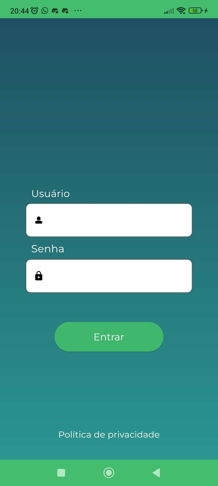
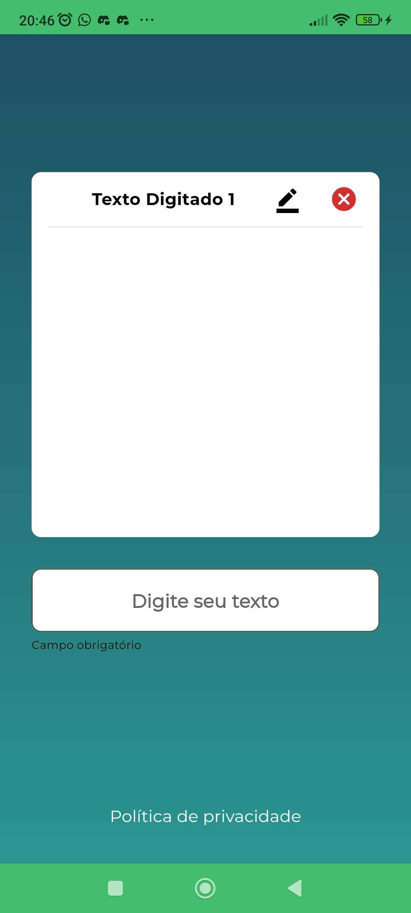

Comptrade

# _App Authenticator_

 


O Authenticator é um projeto Flutter elaborado com o propósito de demonstrar habilidades práticas na construção de um aplicativo, seguindo boas práticas e técnicas de desenvolvimento. 

A base para essa execução está nesse link [PROVA FLUTTER](https://communication-assets.gupy.io/production/companies/519/emails/1699361623620/communication-assets-bea12160-7a4f-11ee-bc34-0fe607fe7114/prova_flutter.pdf)


Nesse documento contém a documentação simples da [Arquitetura do projeto](ARCHITECTURE.md).

## Projeto Status
 
## Como usar 

**Passo 1:**

Baixe ou clone este repositório usando o link abaixo:

```
https://github.com/flavioacv/authenticator.git
```

**Passo 2:**

Vá para a raiz do projeto e execute o seguinte comando no console para obter as dependências necessárias: 

```
flutter pub get 
```

**Passo 3:**

Este projeto utiliza `Mobx` biblioteca que trabalha com geração de código, execute o seguinte comando para gerar arquivos:

```
dart run build_runner build --delete-conflicting-outputs
```

ou assista ao comando para manter o código-fonte sincronizado automaticamente:

```
dart run build_runner watch
```

**Passo 4:**

Este projeto utiliza `Json Rest Server` como _mockAPI_. Para utilizar é necessário ative o Json Rest Server pelo pub:

```
dart pub global activate json_rest_server
```

Depois que ativar o  `Json Rest Server` abra o diretorio `..\server>` pode executar o comando abaixo para rodar a api:

```
json_rest_server run
```
**Passo 5:**

Vá ate o arquivo o `core_module.dart`:

```
lib/
|- app/
    |- core
        |- core_module.dart
```
Configure o ip do servidor para poder funcionar o login do app:

```dart
class CoreModule extends Module {
  @override
  void exportedBinds(Injector i) {
    i.add<Dio>(
      () => Dio(
        BaseOptions(
          baseUrl: 'http://192.168.3.22:8080/', //CONFIGURE AQUI
          contentType: "application/json",
          connectTimeout: const Duration(seconds: 10),
          receiveTimeout: const Duration(seconds: 10),
        ),
      ),
    );
    i.add<LocalStorageService>(LocalStorageServiceImpl.new);
    i.add<HttpClientService>(HttpClientDioServiceImpl.new);
    i.add<LaunchService>(LaunchServiceImpl.new);
  }
}

```

**Passo 6:**

Pronto ! pode executar o comando para iniciar o app:

```
flutter run
```

## Ocultar arquivos gerados (Opcional)

Para ocultar os arquivos gerados, navegue até `Android Studio` -> `Preferences` -> `Editor` -> `File Types` e cole as linhas abaixo na `ignore files and folders` seção:

```
*.g.dart;
```

No Visual Studio Code, navegue até `Preferences` -> `Settings` e pesquise `Files:Exclude`. Adicione os seguintes padrões:
```
**/*.g.dart
```


## Recursos padrão:

* Splash
* Login
* Tela de Lista

### Bibliotecas e ferramentas usadas

* [flutter_modular](https://pub.dev/packages/flutter_modular) (Em uma arquitetura monolítica, onde temos toda a nossa aplicação em um único módulo, projetamos nosso software de forma rápida e elegante, aproveitando todos os incríveis recursos do Flutter.)
* [shared_preferences](https://pub.dev/packages/shared_preferences) (Agrupa armazenamento persistente específico da plataforma para dados simples (NSUserDefaults no iOS e macOS, SharedPreferences no Android, etc.).)
* [dio](https://pub.dev/packages/dio) (Um poderoso pacote de rede HTTP para Dart/Flutter, suporta configuração global, interceptadores, FormData, cancelamento de solicitação, upload/download de arquivos, tempo limite, adaptadores personalizados, transformadores, etc.)
* [mobx](https://pub.dev/packages/mobx) (MobX é uma biblioteca de gerenciamento de estado que simplifica a conexão dos dados reativos do seu aplicativo com a UI. Essa fiação é totalmente automática e parece muito natural.)
* [flutter_mobx](https://pub.dev/packages/flutter_mobx) (Fornece o Observerwidget que escuta observáveis ​​e reconstrói automaticamente as alterações.)
* [google_fonts](https://pub.dev/packages/google_fonts) (Um pacote Flutter para usar fontes de fonts.google.com.)
* [flutter_spinkit](https://pub.dev/packages/flutter_spinkit) (Uma coleção de indicadores de carregamento animados com vibração. Fortemente inspirado no SpinKit.)
* [url_launcher](https://pub.dev/packages/url_launcher) (Um plugin Flutter para lançar um URL.)
* [shimmer](https://pub.dev/packages/shimmer) (Um pacote fornece uma maneira fácil de adicionar efeito de brilho no projeto Flutter.(usado no loading))
* [flutter_native_splash](https://pub.dev/packages/flutter_native_splash) (Este pacote gera automaticamente código nativo para iOS, Android e Web para personalizar a cor de fundo e a imagem inicial da tela inicial nativa.)
* [flutter_launcher_icons](https://pub.dev/packages/flutter_launcher_icons) (Uma ferramenta de linha de comando que simplifica a tarefa de atualizar o ícone do iniciador do seu aplicativo Flutter.)
* [mobx_codegen](https://pub.dev/packages/mobx_codegen) (Adiciona suporte para anotar seu código MobX com @observable, @computed, @action, tornando super simples o uso do MobX.)
* [build_runner](https://pub.dev/packages/build_runner) (O pacote fornece uma maneira concreta de gerar arquivos usando código Dart. Os arquivos são sempre gerados diretamente no disco e as reconstruções são incrementais – inspiradas em ferramentas como o Bazel)
* [json_rest_server](https://pub.dev/packages/json_rest_server) (Tenha um servidor RESTful 100% funcional com autenticação, paginação e todos os serviços necessários para desenvolvimento de aplicações)


### Estrutura de pastas
Aqui está a estrutura de pastas na estrutura do app.

```
flutter-app/
|- android
|- assets
|- build
|- ios
|- lib/
    |- app/
        |- core/
            |- core_module
            |- exception
            |- navigation
            |- services
            |- themes
            |- types
            |- value_objects
            |- widgets
        |- modules 
        |- app_module.dart
        |- app_widget.dart
    |- main.dart
|- server
|- test
```
##  Layout do App

_
_


